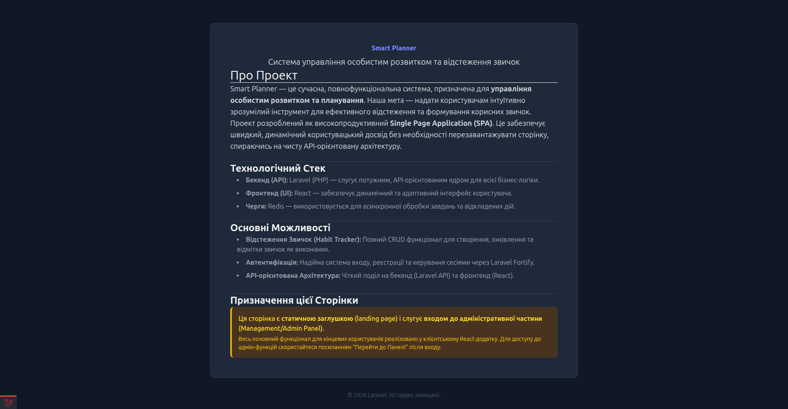
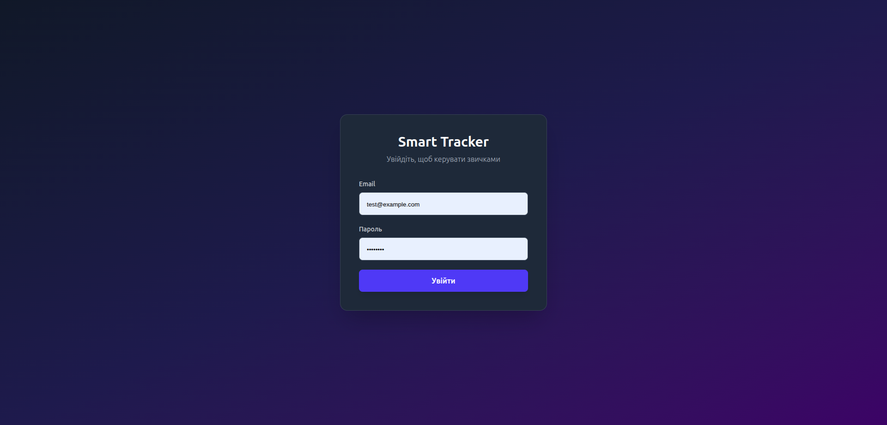

# Smart Planner

Smart Planner is a simple but realistic planner and habit-tracking application built as a learning project.

The goal of this repository is to start with a **Laravel backend API**, then progressively add:
- a **React web frontend**
- a **React Native mobile application**

All clients will use the same backend and data model.

---

## 📘 API Documentation (OpenAPI)

👉 **Live API docs:**  
https://borschcode.github.io/smart-planner/

This page renders the `openapi.yaml` file from this repository using Swagger UI.

---

## 🖼 Preview

### API Index

### React Frontend (Login)

---

## 🎯 Project Goals

- Learn how to design a clean REST API with Laravel
- Practice real-world backend architecture
- Gradually learn React using a real API
- Reuse the same business logic for web and mobile
- Understand how frontend and backend work together

This is not a tutorial dump project — it is a step-by-step learning journey.

---

## 🧩 Core Concept

Users can:
- create tasks or habits
- mark them as completed
- track daily or weekly progress

The UI will evolve, but the backend API will stay consistent.

---

## 🏗 Project Structure

